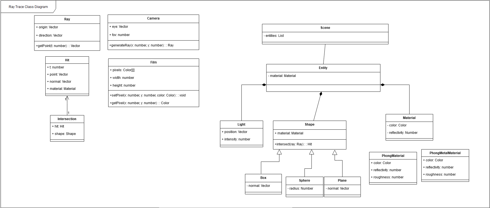

# RayTrace

## Breve Descrição

Este software é uma implementação de um algoritmo de traçado de raios em um framework web, com modelagem de cena e configuração de parâmetros. O programa se enquadra na área de computação gráfica e destina-se a pessoas interessadas em entender a modelagem de um simulador físico de cenas gráficas utilizando algoritmos de traçado de raios com iluminação global e técnicas de aceleração do processo. Embora utilize uma tecnologia que pode se tornar obsoleta rapidamente, espera-se que seja uma ferramenta valiosa para a experimentação de algoritmos e aprendizado de técnicas.

### Funções Específicas
- Exibição de um modelo de renderizador.
- Framework para modelagem de cenas.
- Visualização de cenas modeladas para renderização com RayTrace.
- Monitoramento de parâmetros de performance da renderização.
- Visualização de profundidades de raios para compreensão dos algoritmos.
- Customização de configurações, incluindo:
  - Teste de colisão (Hit Test)
  - Renderização de normais no ponto de colisão (Hit point Normal Render)
  - Ângulo de incidência do raio (Hit Incidence Angle)
  - Decaimento beta (Beta decay)
- Implementação utilizando técnicas de estimação de integrais de Monte Carlo.
- Utilização da técnica da roleta russa.

### Público-alvo
O programa foi concebido para atender alunos de computação gráfica, algoritmos de traçado de raios, técnicas de simulação física e técnicas de otimização.

### Natureza do Programa
Este é um experimento web de modelagem e aplicação de algoritmos de traçado de raios com diversas configurações e cenários.

### Ressalvas
O software utiliza processamento em CPU, podendo ser mais lento que aplicações convencionais que utilizam GPU e/ou aceleradores gráficos.


## Visão de Projeto

***

### Cenário Positivo 1 (i.e. cenário que dá certo)Cenário 1: Adição de Nova Entidade

João, um estudante de computação gráfica, está desenvolvendo um projeto de modelagem 3D para seu curso e quer adicionar uma nova entidade à sua cena, composta por formas geométricas e materiais personalizados. Ele abre o software e usa a interface de modelagem para criar uma nova entidade. João escolhe um cubo como forma base e aplica um material metálico com textura personalizada. Após configurar as propriedades da entidade, João clica em "Carregar". A nova entidade é renderizada perfeitamente na cena, com as propriedades definidas por João, mostrando que o sistema é flexível e suporta a adição de novas entidades sem problemas.

### Cenário 2: Customização Avançada de Iluminação

Maria, uma designer de iluminação cênica, está utilizando o software para simular diferentes configurações de iluminação para um palco teatral. Maria ajusta os parâmetros de iluminação na interface do software, alterando a intensidade, cor e posição das fontes de luz. Ela adiciona uma luz direcional para simular o foco do holofote principal e uma luz ambiente para criar um efeito de preenchimento suave. A cena é renderizada com sombras realistas e reflexos precisos, permitindo que Maria visualize como as diferentes configurações de iluminação afetarão o ambiente cênico, demonstrando a eficiência e precisão do algoritmo de traçado de raios implementado.


### Cenário Negativo 1 - Falha na Importação de Formato Externo

João tenta importar um arquivo de cena em um formato pouco comum, que não é suportado pelo sistema. João seleciona o arquivo no formato XYZ e clica em "Importar". Ele espera que o modelo apareça na tela para começar a avaliá-lo. O sistema exibe uma mensagem de erro informando que o formato do arquivo não é suportado. João não consegue importar o modelo, evidenciando a necessidade de suportar mais formatos ou fornecer melhores mensagens de erro e instruções.


### Cenário Negativo 2 - Erro de Renderização devido a Sobrecarga de Recursos

João cria cenas complexas com muitos detalhes, está trabalhando em uma cena detalhada com muitos objetos, texturas de alta resolução e efeitos de iluminação complexos, usando um laptop com recursos limitados. João adiciona diversos objetos e configura múltiplas fontes de luz e efeitos de sombra. Ele inicia a renderização esperando ver o resultado final em alta qualidade. O sistema começa a processar a cena, mas devido à sobrecarga de CPU e alto consumo de memória, torna-se extremamente lento e eventualmente trava. João percebe que a renderização de cenas muito complexas em hardware limitado é inviável, destacando a necessidade de otimizações ou avisos sobre limitações de recursos.

## Documentação Técnica do Projeto

Esta seção da Wiki se destina a pessoas que queiram reutilizar, total ou parcialmente, o seu programa. Portanto, ofereça todas as informações necessárias. Os três itens a seguir são os mais utilizados. Escolha com o(a) orientador(a) do projeto quais destes itens devem ser incluídos. Para cada item incluído, crie uma seção específica.
- Especificação de requisitos funcionais e não-funcionais do sotware
- Descrição ou modelo de arquitetura, dados, semântica ou outra dimensão relevante do software
- Descrição ou modelo funcional do software
- Sobre o código (detalhes da linguagem ou da técnica de programação utilizada, da estratégia de comentários em linha, das diretivas de compilação, se houver, etc.)




```yaml
CONFIG:
  scene_name: "Example Scene"
  background_color: "#000000"
  render_quality: "high"

SCENE:
  CAMERA:
    ACTIONS:
    - ROTATE_X: -10
    - ADD_ORIGIN: 
        ...
  entities:
    - NAME: "Pontual Light 1"
      LIGHT:
        TYPE: "Pontual"
        ...
    - NAME: "Floor"
      MATERIAL:
        TYPE: "Phong"
        ...
      SHAPE:
        TYPE: "Box"
      TRANSFORMS:
        - TRANSLATE:
           ...
        - SCALE:
           ...
    - NAME: "Sphere"
      MATERIAL:
        TYPE: "Phong"
           ...
      SHAPE:
        TYPE: "Sphere"
      TRANSFORMS:
        - TRANSLATE:
           ...

```

## Requisitos Funcionais

### 1. Exibição do Modelo de Renderizador
- **ID:** RF-01
- **Descrição:** O sistema deve ser capaz de renderizar cenas gráficas configuradas pelo usuário.
- **Entrada:** Arquivo de configuração YAML contendo a definição da cena.
- **Saída:** Renderização visual da cena definida.

### 2. Modelagem de Cenas
- **ID:** RF-02
- **Descrição:** O sistema deve fornecer modelos que permitam aos usuários modelar cenas gráficas.
- **Entrada:** Interface de usuário para definição de entidades, materiais, formas e transformações.
- **Saída:** Cena modelada pronta para renderização.

### 3. Visualização de Cenas Modeladas para Renderização com RayTrace
- **ID:** RF-03
- **Descrição:** O sistema deve permitir a visualização de cenas modeladas utilizando o algoritmo de traçado de raios.
- **Entrada:** Cena modelada.
- **Saída:** Visualização da cena renderizada.

### 4. Monitoramento de Parâmetros de Performance da Renderização
- **ID:** RF-04
- **Descrição:** O sistema deve monitorar e exibir parâmetros de performance durante a renderização.
- **Entrada:** Processos de renderização.
- **Saída:** Métricas de performance (tempo de renderização, uso de CPU, etc.).

### 5. Visualização de Profundidades de Raios para Compreensão dos Algoritmos
- **ID:** RF-05
- **Descrição:** O sistema deve permitir a visualização das profundidades dos raios para ajudar na compreensão dos algoritmos de traçado de raios.
- **Entrada:** Processos de renderização com traçado de raios.
- **Saída:** Visualização das profundidades dos raios.

### 6. Customização e Técnicas de Renderização
- **ID:** RF-06
- **Descrição:** O sistema deve permitir a customização de várias configurações e ativação do uso de técnicas avançadas de renderização para experimentação de algoritmos.
- **Sub-requisitos:**
  - **Configurações de Renderização:**
    - **Teste de Colisão (Hit Test):** Verificação dos pontos de colisão dos raios.
    - **Renderização de Normais no Ponto de Colisão (Hit Point Normal Render):** Visualização das normais no ponto de colisão.
    - **Ângulo de Incidência do Raio (Hit Incidence Angle):** Cálculo do ângulo de incidência dos raios.
    - **Decaimento Beta (Beta Decay):** Aplicação da técnica de decaimento beta.
  - **Técnicas:**
    - **Estimação de Integrais de Monte Carlo:** Implementação para a renderização utilizando estimação de Monte Carlo.
    - **Roleta Russa:** Implementação para otimização do traçado de raios.

## Requisitos Não Funcionais

### 1. Desempenho
#### 1.1. Monitoramento do Tempo de Renderização
- **ID:** RNF-01
- **Descrição:** O sistema deve permitir que os usuários acompanhem e estimem a duração da renderização de cenas.
- **Prioridade:** Alta

#### 1.2. Especificações de Hardware
- **ID:** RNF-02
- **Descrição:** O sistema deve utilizar CPU e consumir até 4GB de RAM, sendo projetado para configurações de hardware modernas.
- **Prioridade:** Alta

### 2. Usabilidade
#### 2.1. Interface do Usuário
- **ID:** RNF-03
- **Descrição:** A interface do sistema deve ser uma aplicação web desenvolvida com o framework Angular.
- **Prioridade:** Alta

#### 2.2. Suporte a Múltiplos Idiomas
- **ID:** RNF-04
- **Descrição:** A interface do sistema deve oferecer suporte para termos em inglês e português.
- **Prioridade:** Média

### 3. Confiabilidade
#### 3.1. Tratamento de Falhas de Hardware
- **ID:** RNF-05
- **Descrição:** O sistema não deve tratar falhas de hardware durante a renderização, mas deve ser robusto para falhas comuns.
- **Prioridade:** Média

### 4. Manutenibilidade
#### 4.1. Convenções de Codificação
- **ID:** RNF-06
- **Descrição:** O sistema deve ser desenvolvido utilizando orientação a objetos e TypeScript, seguindo boas práticas de codificação.
- **Prioridade:** Alta

### 5. Portabilidade
#### 5.1. Sistemas Operacionais Suportados
- **ID:** RNF-07
- **Descrição:** O sistema deve ser compatível com qualquer sistema operacional capaz de executar um servidor web e cliente HTML5.
- **Prioridade:** Alta

#### 5.2. Navegadores Suportados
- **ID:** RNF-08
- **Descrição:** O sistema deve ser compatível com qualquer navegador moderno que suporte aplicações web desenvolvidas em Angular.
- **Prioridade:** Alta

### 6. Tecnologia e Implementação
#### 6.1. Uso de Modelos e Classes Próprias
- **ID:** RNF-09
- **Descrição:** O sistema deve utilizar modelos e classes próprias para a modelagem e renderização de cenas, sem recorrer a ferramentas prontas ou bibliotecas externas específicas para essa tarefa.
- **Prioridade:** Alta

#### 6.2. Exclusão de Aceleradores Gráficos
- **ID:** RNF-10
- **Descrição:** O sistema não deve utilizar aceleradores gráficos como GPUs para o processamento de renderização.
- **Prioridade:** Alta

#### 6.3. Implementação de Algoritmos Internamente
- **ID:** RNF-11
- **Descrição:** Todos os algoritmos de renderização e traçado de raios devem ser implementados internamente, sem utilizar algoritmos prontos ou bibliotecas externas.
- **Prioridade:** Alta

## Manual de Utilização para Usuários Contemplados

> O manual de utilização deve ser elaborado **para todos os tipos de usuários contemplados**. Deve também ser consistente com todo o restante do conteúdo da Wiki, o que inclui descrição, cenários e documentação técnica.

O formato mais prático para a elaboração de um manual de uso é seguir a estrutura sugerida a seguir, **para cada tarefa que o usuário pode realizar (o que envolve usar várias funções) e para cada função básica que o programa oferece**:

```
{ 
  Guia de Instruções:
  %%%%%%%%%%%%%%%%%%%%%%%%%%%%%%%%%
  Para [Tarefa A: por exemplo, no cenário usado, BUSCAR VÍDEO] faça:
  Passo 1: ...
  Passo 2: ...
  ...
  Passo N: ...

  >>> Se houver diferentes maneiras de realizar a Tarefa A, descreva cada uma delas.
  >>> E se em certos contextos, uma alternativa for melhor que outra, informe e explique.

  Exceções ou potenciais problemas:
  %%%%%%%%%%%%%%%%%%%%%%%%%%%%%%%%%
  Se [Condição Prevista C1: por exemplo, o vídeo for encontrado mas o link está 'quebrado']
     {
     Então faça: [Passo 1, Passo 2, ..., Passo N] 
     ou
     É porque: [explique o problema, se não há uma sugestão para solucionar] 
     } 
  
  Se [Condição Prevista C2: ... 
  ...
  Se [Condição Prevista CN: ...      
}

>>> Repita a estrutura do Guia acima para cada tarefa e função básica.

```